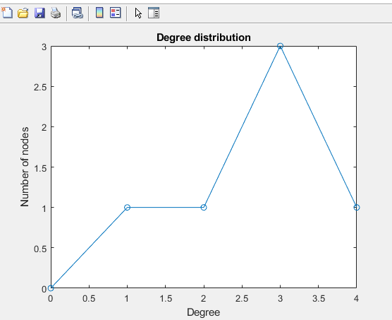
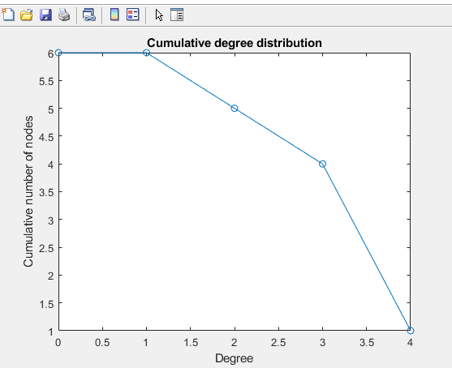

# AAE560-NetworkTheoryCalculations
Compute various network calculations
Here are some example plots for degree distribution and culmulative degree distribution. The following calculations can be computed:
Degree
Degree Centrality
Degree Correlation
Clustering Coefficient
Degree Distribution
Culmulative Degree Distribution
Barabasi-Albert Growth for new node for one connection to the highest probability

