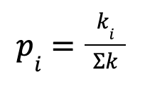

# AAE560-NetworkTheoryCalculations
Compute various network calculations
Here are some example plots for degree distribution and culmulative degree distribution. The following calculations can be computed:
- Degree
- Degree Centrality
- Degree Correlation
- Clustering Coefficient
- Degree Distribution
- Culmulative Degree Distribution
- Barabasi-Albert Growth for new node for one connection to the highest probability

Here is an example for the following network:

The matrix is as follows:

The degree is

Clustering Coefficient for each node is calculated as follows:

The probability of a new node being added to a network is based on the calculation for each node using the Barabasi-Albert formula:

